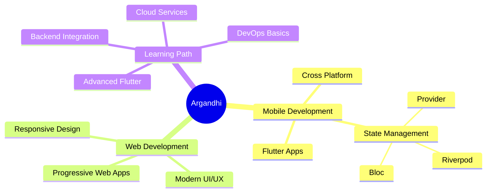

<div align="center">

<!-- Animated Wave Header -->


<!-- Animated Typing Text -->
<a href="https://git.io/typing-svg">
  
</a>

<br/>

<!-- Animated Developer Illustration -->


<br/>

<!-- Profile Badges -->
<p>
  
  
  
</p>

</div>

---

## 🚀 About Me

```typescript
const developer = {
  name: "Argandhi23",
  location: "Ngawi, East Java 🇮🇩",
  role: "Mobile & Web Developer",
  workspace: {
    laptop: "💻",
    os: "Windows/Linux",
    editor: "VS Code",
    design: "Figma"
  },
  code: ["Dart", "JavaScript", "Java", "PHP", "HTML", "CSS"],
  focus: ["Flutter", "Mobile Apps", "Web Development", "UI/UX"],
  learning: "Always exploring new tech! 🚀",
  motto: "Code with passion, build with purpose ✨"
};
```

---

## 💻 Tech Stack

<div align="center">

<!-- Mobile Development -->
<h3>📱 Mobile Development</h3>
<p>
  
</p>

<!-- Frontend Development -->
<h3>🎨 Frontend Development</h3>
<p>
  
</p>

<!-- Backend & Database -->
<h3>⚙️ Backend & Database</h3>
<p>
  
</p>

<!-- Tools & Others -->
<h3>🛠️ Tools & Others</h3>
<p>
  
</p>

</div>

---

## 📊 GitHub Stats

<div align="center">
  
  <!-- GitHub Stats Card -->
  
  
  <!-- GitHub Streak -->
  

</div>

<div align="center">
  
  <!-- Top Languages -->
  
  
  <!-- Activity Graph -->
  

</div>

---

## 🏆 GitHub Trophies

<div align="center">
  
</div>

---

## 🐍 Contribution Snake

<div align="center">
  <picture>
    <source media="(prefers-color-scheme: dark)" srcset="https://raw.githubusercontent.com/Argandhi23/Argandhi23/output/github-contribution-grid-snake-dark.svg">
    <source media="(prefers-color-scheme: light)" srcset="https://raw.githubusercontent.com/Argandhi23/Argandhi23/output/github-contribution-grid-snake.svg">
    
  </picture>
</div>

---

## 💼 Current Focus

<div align="center">



</div>

---

## 🎯 2025 Goals

<div align="center">

| Goal | Progress | Status |
|------|----------|--------|
| 🚀 Build 5 Flutter Apps | ▓▓▓▓░░░░░░ 40% | In Progress |
| 📚 Master State Management | ▓▓▓▓▓▓░░░░ 60% | Learning |
| 🌐 Contribute to Open Source | ▓▓░░░░░░░░ 20% | Starting |
| 💼 Land Dream Job | ░░░░░░░░░░ 0% | Planning |

</div>

---

## 📫 Connect With Me

<div align="center">

[](https://linkedin.com/in/yourprofile)
[](https://instagram.com/yourprofile)
[](https://twitter.com/yourprofile)
[](https://yourportfolio.com)
[](mailto:youremail@gmail.com)

<br/>

<!-- Random Dev Quote -->


</div>

---

## 💡 Random Dev Joke

<div align="center">


</div>

---

## 🎵 Spotify Playing

<div align="center">

[](https://open.spotify.com/user/yourusername)

</div>

---

## 📈 Contribution Graph

<div align="center">


</div>

---

<div align="center">

### 💬 "Talk is cheap. Show me the code." - Linus Torvalds

<br/>

<!-- Animated Footer Wave -->


**Thanks for visiting! Star ⭐ my repos if you like them!**

</div>
